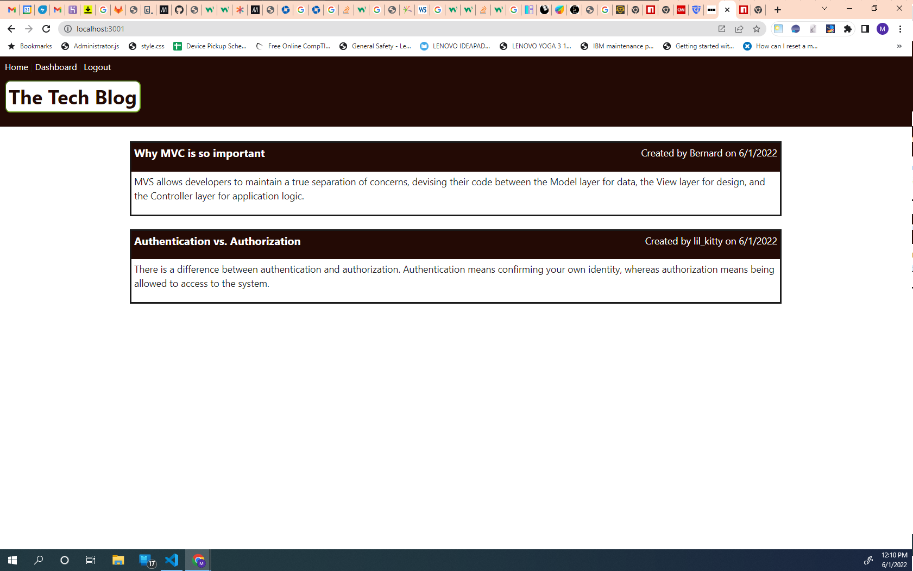

# Thrashin_Tech_Blog
This is a student toy project to demonstrate proficiency with full-stack programming using a MySQL database and Sequel modeling.  
  

## Introduction  

Thrashin Tech Blog is blog site where developers can submit blog post and comment on other posts. The implementation follows the Model-View-Controller (MVC), uses the templating language Handlebars.js and uses Sequelize for Object-Relational Mapping (ORM). 

## Links  

The Git Repository containing this porject code and this README file: https://github.com/mjtanner-github/Thrashin_Tech_Blog.   
The Heroku deployment: https://thrashin-tech-blog.herokuapp.com.

## Features

- Works without an internet connection and may be installed as a PWA. 

- Employs an IndexedDB and implements both GET and PUT methods.

- Saves content from the text editor automatically when user focused changes away from the application window.

## Technology

- _Babel_ to implement async and await.

- _Webpack_ application component bundling.

- _WebpackPwaManifest_ application to generated manifest.json.

- _Workbox_  service worker that caches static assets.

## Routine Usage

Just click on the link or the PWA shortcut. Then you type, delete, cut and paste like you do. There is no saving; that's always done automatically, when your click away from the window or close the application. It's always there when you come back.

## License 

All materials in this repository other than this document are copyrighted bt Trilogy Education Services, LLC:   
© 2022 Trilogy Education Services, LLC, a 2U, Inc. brand. Confidential and Proprietary. All Rights Reserved.
